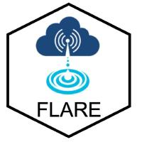

# NEON lake forecasts in R using FLAREr (Forecasting Lake And Reservoir Ecosystems)

-----
:busts_in_silhouette: Ryan McClure, Quinn Thomas, Tadhg Moore, Cayelan Carey, Renato Figueiredo, Whitney Woelmer, Heather Wander, Vahid Daneshmand    

:email: Questions?  Email: ryan333@vt.edu, rqthomas@vt.edu, cayelan@vt.edu, or tadhgm@vt.edu

-----

## Motivation

Thank you for checking out NEON-forecast-code. Freshwater lakes globally are increasingly threatened as a result of rapidly changing land use and climate, are the most threatened ecosystems on Earth (Carpenter et al., 2011). In response, developing forecast workflows has has emerged as a powerful tool to predict future environmental conditions in lakes in order to make informed management decisions for safety, health, and conservation (Carey et al., 2021; Baracchini et al., 2020; Page et al., 2018). However, the discipline of forecasting lake processes is still in early stages of making robust forecasts that are flexible such that they can be applied across many lakes. As a result, there is a dire need for open-source forecast workflows that are broadly applicable to many different lake ecosystems and flexible to different datastreams and local needs.

## Prerequisites

FLAREr has been tested across Windows, Mac, and Linux OS. It also requires R version 4.0.x or higher.

### Word of caution

Some packages will need manual compilation <b>if you have a Mac OS with the new Apple silicon arm64</b> (M1 chip) and have recently updated to R 4.1.0-arm64. The specific package is udunits. Homebrew is not yet (to our knowledge) bottled for udunits and Apple silicon so go here to download the version of udunits for 4.1.0-arm64: https://mac.r-project.org/libs-arm64/udunits-2.2.28-darwin.20-arm64.tar.gz. 

## Cloning NEON-forecast-code onto your computer (5 steps)
1. Go to the [NEON-forecast-code](https://github.com/FLARE-forecast/NEON-forecast-code) repository and copy the repo URL. 
2. Open R
3. Start a new project: File > New Project
4. Select: Version Control > Git
5. Paste the repo's URL into "Repository URL:", keep the project directory name as the default, select "open in new session", and click <b>New Project<b>

## Forecast Setup
  
