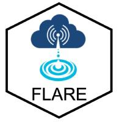

# NEON lake forecasts in R using FLAREr (Forecasting Lake And Reservoir Ecosystems)

-----

:busts_in_silhouette: Ryan McClure, Quinn Thomas, Tadhg Moore, Cayelan Carey, Renato Figueiredo, Whitney Woelmer, Heather Wander, Vahid Daneshmand   

:busts_in_silhouette: Special thanks to: Carl Boettiger, Bobby Hensley, Eric Sokol, Kathleen Weathers

Questions?  :email: ryan333@vt.edu, rqthomas@vt.edu, cayelan@vt.edu, or tadhgm@vt.edu

-----

## Motivation

Thank you for checking out NEON-forecast-code. Freshwater lakes globally are increasingly threatened as a result of rapidly changing land use and climate ([Carpenter et al., 2011](https://www.annualreviews.org/doi/abs/10.1146/annurev-environ-021810-094524)). In response, developing forecast workflows has has emerged as a powerful tool to predict future environmental conditions in lakes in order to make informed management decisions for safety, health, and conservation ([Carey et al., 2021](); [Baracchini et al., 2020](https://www.sciencedirect.com/science/article/pii/S0043135420300658); [Page et al., 2018](https://www.sciencedirect.com/science/article/pii/S0043135418300605)). However, the discipline of forecasting in lakes is still in the early stages of making forecasts that are robust and reproducible. As a result, there is a dire need for open-source forecast workflows that are broadly applicable to many different lake ecosystems and flexible to different datastreams and local needs.

Here, we applied the FLAREr forecasting system ([Thomas et al., 2020](https://agupubs.onlinelibrary.wiley.com/doi/full/10.1029/2019WR026138)) to six NEON lakes to test FLAREr's robustness and scalability to other sites. The NEON lakes serve as an exemplar case to test FLARE because they have reliable, open-source datastreams in which new data can be acquired at relatively low latencies (<1.5 months). The goal of our forecast scaling study was to show that FLAREr is scalable to other lake ecosystems and can produce robust forecasts of water temperatures up to 35-days into the future. Altogether, we hope this workflow is a first step to building a community of lake and reservoir forecast practitioners that develop reliable forecast workflows and make informed decisions for future lake conservation and management.

## Prerequisites

FLAREr has been tested across Windows, Mac, and Linux OS. It also requires R version 4.0.x or higher.

## Workflow 1: NEON six lake analysis (Thomas et al. In prep)

### On your local computer

1. Go to the [NEON-forecast-code](https://github.com/FLARE-forecast/NEON-forecast-code) repository and copy the repo URL. 
2. Open R
3. Start a new project: File > New Project
4. Select: Version Control > Git
5. Paste the repo's URL into "Repository URL:", keep the project directory name as the default, select "open in new session", and click <b>New Project</b>
https://mybinder.org/v2/gh/rqthomas/NEON-forecast-code/main?urlpath=rstudio
6. When you have cloned the project into R, run `source("workflows/neon_lakes_ms/install.R")` to install the necessary packages.   
7. Run `workflows/neon_lakes_ms/01_combined_paper_workflows.R` to generate the forecasts.   
8. Once the forecasts are generated, run `workflows/neon_lakes_ms/02_score_forecasts.R` to evaluate forecasts.  
9. Once the forecasts are scored, run `workflows/neon_lakes_ms/03_ms_figures.R` to produce the figures and analysis in the manuscript.    

### Using mybinder.org

You can run the analysis remotely using a binder that generates an Rstudio environment with the necessary packages installed.

1. Enter the following url into a web browser: [https://mybinder.org/v2/gh/rqthomas/NEON-forecast-code/main?urlpath=rstudio](https://mybinder.org/v2/gh/rqthomas/NEON-forecast-code/main?urlpath=rstudio).  
2. Run `workflows/neon_lakes_ms/01_combined_paper_workflows.R` to generate the forecasts.   
3. Once the forecasts are generated, run `workflows/neon_lakes_ms/02_score_forecasts.R` to evaluate forecasts.   
4. Once the foreasts are scored, run `workflows/neon_lakes_ms/03_ms_figures.R` to produce the figures and analysis in the manuscript.   
